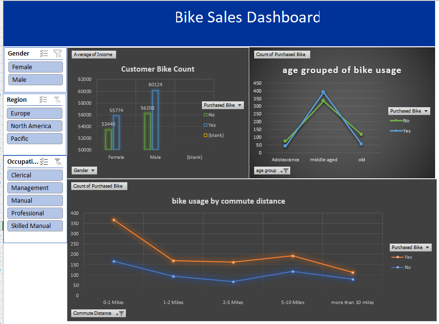

#  Bike Sales Dashboard – Excel

## 📊 Dashboard Preview

## 📌 Project Overview

This project is an interactive **Bike Sales Dashboard built using Microsoft Excel** to analyze customer demographics and bike purchasing behavior.

The project takes raw customer data, cleans and transforms it, summarizes the data using Pivot Tables, and presents the findings through an interactive dashboard.

## 🎯 Objective

The main objective of this project is to analyze customer characteristics and identify patterns associated with bike purchases.

The analysis focuses on factors such as:

* Age
* Gender
* Income
* Marital Status
* Education
* Occupation
* Region
* Commute Distance

## 🛠️ Tools & Excel Features Used

* Microsoft Excel
* Data Cleaning
* Excel Formulas
* Pivot Tables
* Pivot Charts
* Slicers
* Conditional Formatting
* Data Visualization

## 📁 Workbook Structure

The workbook contains four worksheets:

| Worksheet         | Description                                                             |
| ----------------- | ----------------------------------------------------------------------- |
| **bike_buyers**   | Original raw dataset containing 1,000 customer records                  |
| **working_sheet** | Cleaned and transformed dataset, including the age-group classification |
| **pivot_table**   | Pivot Tables used to summarize and analyze the data                     |
| **dashboard**     | Interactive dashboard containing charts and slicers                     |

## 📈 Key Insights

Based on the analysis:

* **481 out of 1,000 customers purchased a bike**, while 519 did not.
* **Middle-aged customers** have the highest purchase rate at approximately **54.0%**.
* The **Pacific region** has the highest bike purchase rate at approximately **58.9%**.
* Customers with a **2–5 mile commute** have the highest purchase rate among commute-distance groups at approximately **58.6%**.
* **Single customers** have a higher purchase rate (**54.1%**) than married customers (**42.9%**).
* Customers with a **Bachelor's degree** have a purchase rate of approximately **55.2%**.
* **Professional** customers have the highest purchase rate among the occupation groups at approximately **54.3%**.
* Customers who purchased bikes have a higher average income (**$57,963**) compared with non-purchasers (**$54,875**).

## 📊 Dashboard Features

The dashboard allows users to explore bike purchasing patterns through interactive visualizations and filters.

The analysis includes comparisons based on:

* Customer demographics
* Age groups
* Income
* Commute distance
* Region
* Purchasing status

## 📂 Project Files

* **[Excel Bike Sales Dashboard.xlsx](Excel%20Bike%20Sales%20Dashboard.xlsx)** – Complete Excel workbook containing the raw data, working data, Pivot Tables, and dashboard.
* **Dashboard Preview.png** – Preview image of the final dashboard.

## 🚀 How to Use

1. Download the Excel workbook.
2. Open it using Microsoft Excel.
3. Navigate to the **dashboard** worksheet.
4. Use the available slicers to filter the dashboard.
5. Explore the visualizations and insights.
6. Refer to the **working_sheet** and **pivot_table** worksheets to understand the analysis process.
